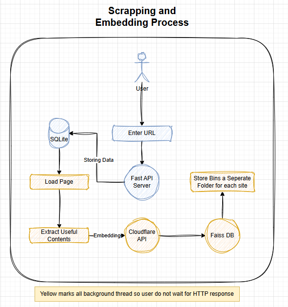
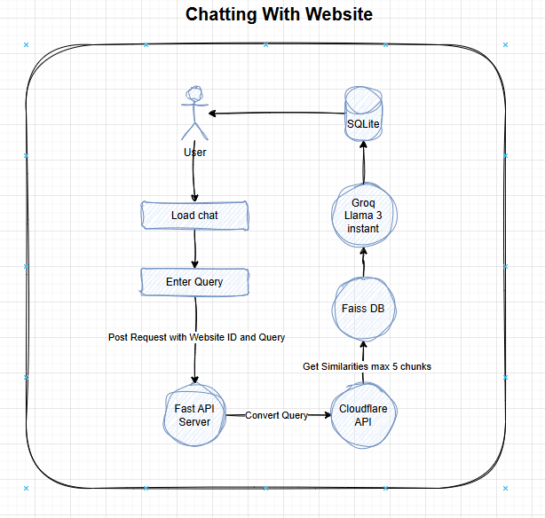
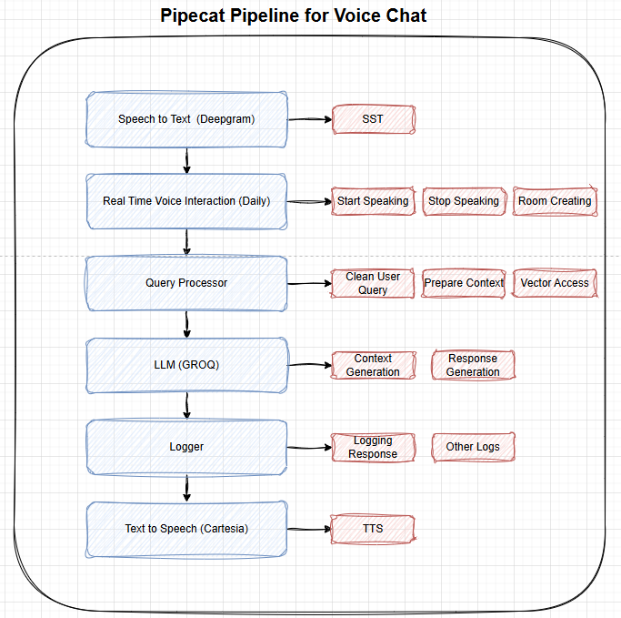

# Pipecat Chatbot

Pipecat Chatbot is an advanced AI-powered conversational agent designed to interact with users via text and voice. It integrates multiple AI models and APIs to provide efficient, scalable, and intelligent chatbot functionalities. This chatbot supports web scraping, embedding content for retrieval, and real-time voice interactions.

## Tech Stack

- **Python**: Programming language used for the backend.
- **Pipecat**: Framework for building the chat bot.
- **Daily**: Used for Text-to-Speech (TTS).
- **Deepgram**: Used for Speech-to-Text (STT).
- **FAISS**: Vector database for storing data.
- **Llama Index**: Used for storing data.
- **Bootstrap**: Frontend framework for styling.
- **jQuery**: JavaScript library for DOM manipulation.
- **Vite**: Build tool for Pipecat.

## Features

- AI-powered chatbot with real-time response capabilities.
- Uses a scraper to store and retrieve data from FAISS vector database.
- Supports both text-based and voice-based interactions.
- Integrates with Cloudflare API for embedding and query processing.

## Scraping and Embedding Process

The following diagram outlines the process for scraping and embedding data from URLs:

### **Workflow**

1. **User Input**: The user enters a URL.
2. **FastAPI Server**: The backend FastAPI server processes the request.
3. **SQLite Storage**: The URL and relevant metadata are stored in an SQLite database.
4. **Loading the Page**: The system fetches the webpage content.
5. **Extracting Useful Content**: Relevant content is extracted from the page.
6. **Embedding via Cloudflare API**: The extracted content is converted into embeddings using Cloudflare API.
7. **Storing in FAISS DB**:
   - The embeddings are stored in the FAISS vector database.
   - The stored binary files are placed in separate folders for each website.

### **Background Processing**

- All steps marked in **yellow** in the diagram are executed in the background thread.
- This ensures that the user does not experience delays while waiting for HTTP responses.

### **Benefits of This Approach**

- **Fast User Experience**: Background threading prevents user wait time.
- **Efficient Data Retrieval**: FAISS vector search enables quick lookups.
- **Scalability**: Storing bins separately ensures organized and efficient storage.

This approach allows for seamless integration of web content into the chatbot for enhanced responses.

## Chatting with Website Process

The following diagram explains the process of how the chatbot interacts with the stored website data:

### **Workflow**

1. **User Loads Chat**: The user opens the chat interface.
2. **User Enters Query**: The user inputs a query related to the stored website data.
3. **FastAPI Server Processes Query**:
   - The query is sent as a POST request with the website ID.
   - The FastAPI server handles the request and sends it for processing.
4. **Cloudflare API Converts Query**: The query is converted into embeddings using Cloudflare API.
5. **Retrieving Relevant Data**:
   - The FAISS vector database finds the most relevant stored content (max 5 chunks).
6. **Groq Llama 3 Processing**:
   - The retrieved content is passed to Groq Llama 3 for response generation.
7. **Retrieving and Displaying Chat**:
   - The response is stored in SQLite for future reference.
   - The response is displayed to the user.

### **Benefits of This Approach**

- **Efficient Query Processing**: Uses FAISS for fast similarity search.
- **Intelligent Responses**: Groq Llama 3 provides intelligent contextual responses.
- **Scalable Architecture**: SQLite storage allows for easy retrieval of chat history.

This approach ensures smooth and intelligent interactions with stored website data for a better user experience.

## Pipecat Pipeline for Voice Chat

The following diagram explains the process of handling voice-based interactions in the chatbot:

### **Workflow**

1. **Speech to Text (STT) via Deepgram**: Converts user speech into text.
2. **Real-Time Voice Interaction (Daily)**:
   - Handles real-time voice communication.
   - Manages actions like **Start Speaking, Stop Speaking, and Room Creating**.
3. **Query Processor**:
   - Cleans the user query.
   - Prepares the context for response generation.
   - Accesses the vector database.
4. **LLM (GROQ) Processing**:
   - Generates relevant context.
   - Generates responses based on user queries.
5. **Logger**:
   - Logs user interactions and responses.
   - Maintains other necessary logs for debugging.
6. **Text to Speech (TTS) via Cartesia**:
   - Converts generated text responses back into speech output.

### **Benefits of This Approach**

- **Seamless Voice Interaction**: Real-time voice chat enhances user experience.
- **Accurate Speech Processing**: Deepgram provides high-quality speech recognition.
- **Efficient Query Handling**: Vector access optimizes data retrieval.
- **Comprehensive Logging**: Keeps track of interactions for analytics and debugging.

This approach ensures smooth voice-based interactions, making the chatbot more intuitive and user-friendly.

